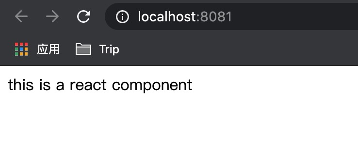

# simple-react-project-creact
手动构建基础react项目（基于webpack）

# 准备工作

## 创建项目

* 创建文件夹并进入 `mkdir simple-react-project-creact && cd simple-react-project-creact`
* 初始化package.json `npm init` 一路回车即可
* 创建基础文件架构 创建src和dist文件夹 index.js文件

此时的文件结构如下

```
simple-react-project-creact
├─README.md
├─index.js          // 项目主入口
├─package.json      // 项目配置文件
├─src               // 资源目录
├─dist              // 打包后的目标文件 可以不创建 webpack会自动创建
```

## 安装依赖
安装webpack和react
```
npm install react react-dom
npm install -D webpack@4 webpack-cli@3.3.12 // 使用webpack4
```

# 构建项目

准备工作做完之后，我们就可以开始构建项目了。

## 初始化webpack

首先就是初始化webapack配置，这里可以使用`npx webpack init` 自动初始化，但一开始还是选择手动创建。
在根目录下创建`webpack.config.js` 并输入以下内容

```
const path = require('path');

const publicPath = '/'

module.exports = {
    mode: 'none',
    entry: {
        main: path.join(__dirname, 'index.js'), // 入口文件
    },
    output: {
        publicPath: publicPath,
        path: path.join(__dirname, 'dist'), // 打包输出路径
        filename: '[name].js',  // 打包文件名字
    }
}
```

接着在`index.js`中随便写点什么， 如`console.log('hello world');`
运行`npx webpack` 可以看到`dist`文件夹中产生了新的文件`main.js`
打开文件，前面都是webpack生成的代码，滚动到最下面，就能看到真正的打包内容。

```
/******/ ([
/* 0 */
/***/ (function(module, exports) {

console.log('hello world');

/***/ })
/******/ ]);
```

## 编写第一个react组件
在`src`目录下创建一个react文件`app.js` 输入该内容 
```
import React from 'react';

const App = (props) => {
    return (
        <div>
            this is a react component
        </div>
    )
}

export default App;
```

并改写`index.js`
```
import React from 'react'
import ReactDOM from 'react-dom'
import App from './src/app'

ReactDOM.render(<App />, document.getElementById('app'));
```

在`dist`目录下创建`index.html` 引入打包后的文件
```
<!DOCTYPE html>
<html>
  <head>
    <meta charset="utf-8">
    <title>Webpack App</title>
  <meta name="viewport" content="width=device-width, initial-scale=1"></head>
  <body>
    <div id="app"></div>
    <script src="main.js"></script>
  </body>
</html>
```

此时不急着打包，因为在刚才的代码中，使用到了jsx和es6的语法，而一般浏览器都不直接支持这些语法，所以我们需要用到`webpack`的`module`功能去转换这些语法，使代码可以在浏览器运行。

改写`webpack.config.js`
```
const path = require('path');

const publicPath = '/'

module.exports = {
    mode: 'none',
    entry: {
        main: path.join(__dirname, 'index.js'), // 入口文件
    },
    output: {
        publicPath: publicPath,
        path: path.join(__dirname, 'dist'), // 打包输出路径
        filename: '[name].js',  // 打包文件名字
    },
    module: {
        rules: [
            {
                test: /\.(js|jsx)$/,
                exclude: /(node_modules|bower_components)/,
                use: 'babel-loader'
            }
        ]
    }
}
```
这里要转换es6及以上语法，还有jsx语法，所以需要用到`preset-env`和`preset-react`
* 安装相关依赖 运行`npm install -D babel-loader @babel/core @babel/preset-env @babel/preset-react`
* 创建`.babelrc` 
```
{
    "presets": ["@babel/preset-env", "@babel/preset-react"]
}
```
* 打包 运行`npx webpack`

到这里为止，其实代码已经可以用了，但是我们不能看到现象，而且打包出来的文件可以看到特别的大，我们加下来解决这些问题。

## 构建服务调试

这里我们就需要用到webpack的又一个功能 `webpack-dev-server`， 它可以给我提供一个web服务，而且具有热编译以及热加载的功能，对我们开发十分的便利。

* 安装依赖 `npm install -D webpack-dev-server`
* 修改webpack配置 在`webpack.config.js`中添加如下节点
```
    devServer: {
        contentBase: './dist',
        publicPath: publicPath,
        //hot: true
    }
```
* 改写`package.json`中的`scripts`节点
```
  "scripts": {
    "start": "webpack-dev-server --open",
    "build": "webpack",
    "test": "echo \"Error: no test specified\" && exit 1"
  }
```
* 运行`npm start`

因为添加了`open`参数，所以会自动打开浏览器页面，这时候我们已经可以看到浏览器成功展示了我们想要展示的信息。


# 补充配置

## 自动生成html

在之前的步骤中，我们是自己写的html而且手动引入的js文件，但是如果生成的打包文件使用了webpack的hash后缀，或者对源文件进行了分割，生产多个文件，每次都要修改html文件，会特别麻烦，所以我们就要使用webpack的`html-webpack-plugin`插件功能，来解决这一个问题。

* 首先把`index.html`从`dist`目录下移到根目录下，且去掉`scriipt`标签
* 安装插件 `npm install -D html-webpack-plugin`
* 改写`webpack.config.js` 插入`plugins`节点 具体`html-webpack-plugin`的配置可以参考[html-webpack-plugin](https://www.webpackjs.com/plugins/html-webpack-plugin/)
```
const path = require('path');
const htmlWebpackPlugin = require('html-webpack-plugin');

const publicPath = '/'

module.exports = {
    ... // 省略和前面一致代码
    plugins: [
        new htmlWebpackPlugin({
            template: './index.html'
        })
    ]
}
```
* 因为之前改了`package.json`的`scripts`，所以这里可以运行`npx  webpack` 或者 `npm run build` 都可以实现打包

然后就可以看到`dist`文件夹下不仅生成了`main.js`，还生成了`index.html`。

## 独立打包第三方库

之前有说到过，明明我们自己写的内容特别少，但是打包出来的文件却特别大，这是因为它不仅增加了webpack自己生成的代码，更关键的是，还有第三方的库`react`和`react-dom`也一起打包了进去，那么如何优雅的处理打包文件呢，就是将所有的第三方库打包到一个文件中，将我们写的代码打包到另一个文件中。

在webpack4之前，使用的都是`CommonsChunkPlugin`这个内置插件，但是从webpack4开始就不需要了，webpack将这个功能集成到了`optimization`模块中，这个功能不仅能独立打包第三方库，还可以打包自定义多次被多个文件引用的模块，具体的配置可以看官网的[optimization](https://webpack.docschina.org/configuration/optimization/#optimizationsplitchunks)文档。

在`webpack.config.js`中添加如下节点
```
    optimization: {
        splitChunks: {
            cacheGroups: {
                vendor: {
                    name: "vendor",
                    test: /[\\/]node_modules[\\/]/,
                    chunks: "all",
                    priority: -10
                }
            }
        }
    }
```

然后再次打包，就可以看到`dist`中生成了三个文件，可以看到`main.js`已经变得很小，只有webpack自动生成的代码和我们自己写的代码了，所有的第三方库全都在`vendor.js`中，而且托`html-webpack-plugin`的福，`index.html`中已经引入了另外两个文件。

## 热加载（Hot Module Replacement）

虽然通过`webpack-dev-server`启动的服务，已经自带了热编译功能，也就是说会自动监听文件的变化，然后实时编译，但是还是免不了需要刷新页面才能看到修改之后的变化，假如我们在页面中进行某些操作，刷新之后就会丢失，这不是我们希望的，所以需要用到热加载的功能。

所谓的热加载就是文件改动后，以最小的代价改变被改变的区域。尽可能保留改动文件前的状态。

在网上搜索，很容易就能找到，一些文章介绍，要启动`webpack-dev-server`的热加载功能，只需要在`webpack.config.js`的`devServer`节点下增加属性`hot: true`即可，但当我们这么操作之后就会发现，修改`app.js`文件，页面还是刷新了，所以仅仅这样是不行的。

可以看官网的[文档](https://webpack.docschina.org/guides/hot-module-replacement/)，可以看到我们需要手动添加`HotModuleReplacementPlugin`，而且需要在入口文件中表明改模块接受热更新。

* 修改`webpack.config.json`文件
```
const path = require('path');
+ const webpack = require('webpack')
const htmlWebpackPlugin = require('html-webpack-plugin');

const publicPath = '/'

module.exports = {
    ...
    plugins: [
        new htmlWebpackPlugin({
            template: './index.html'
        }),
+       new webpack.HotModuleReplacementPlugin()
    ],
    ...
}
```

* 修改`index.js`文件
```
import React from 'react'
import ReactDOM from 'react-dom'
import App from './src/app'

ReactDOM.render(<App />, document.getElementById('app'));

+   if (module.hot) {
+       module.hot.accept(() => {
+           ReactDOM.render(
+               <App />,
+               document.getElementById('app')
+           )
+       })
+   }
```

* `npm start`

此时运行`npm start` 然后修改`app.js`，可以看到页面的内容修改了，但是页面没有完全刷新。

到此为止，一个最基础的react开发项目就搭建好了，可以愉快的写代码了。

# 依然存在的问题
* 本文都是使用的js开发，其实现在很多项目都已经使用了`typescript`，如果需要更改成ts项目，还是需要修改一些配置。
* 虽然实现了热更新，但是只要开发稍微复杂一点组件就会发现，虽然页面保留了下来，但是组件内部的的状态却没有保留下来，要实现这一点，就虚啊哟用到`react-hot-loader`， 具体使用方式可以参考该[文档](https://github.com/gaearon/react-hot-loader)。
* 本文没有设计css、图片等文件，这些文件都可以使用webpack的loader功能加载进来。

